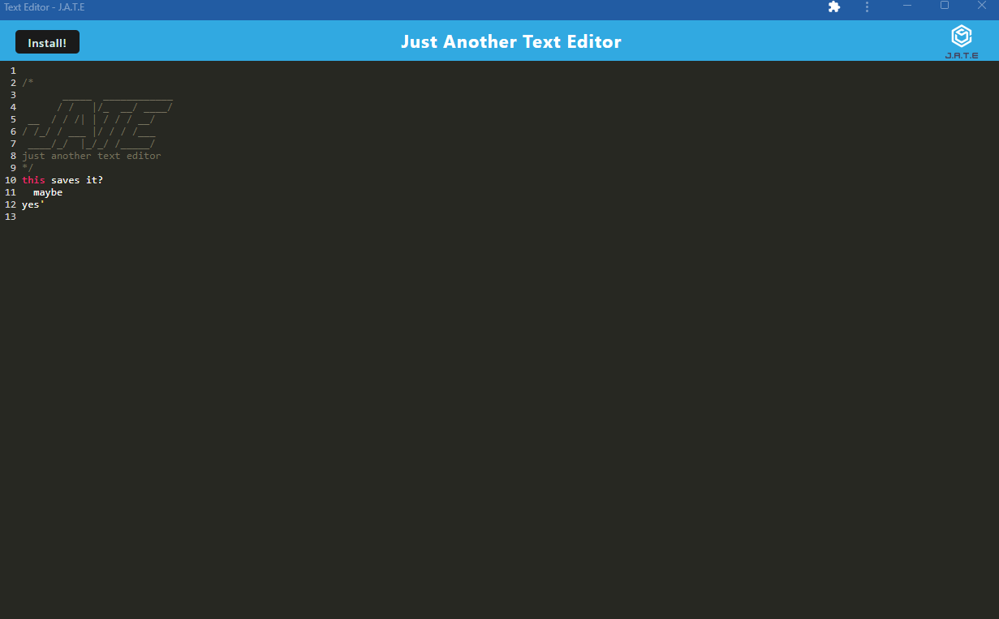
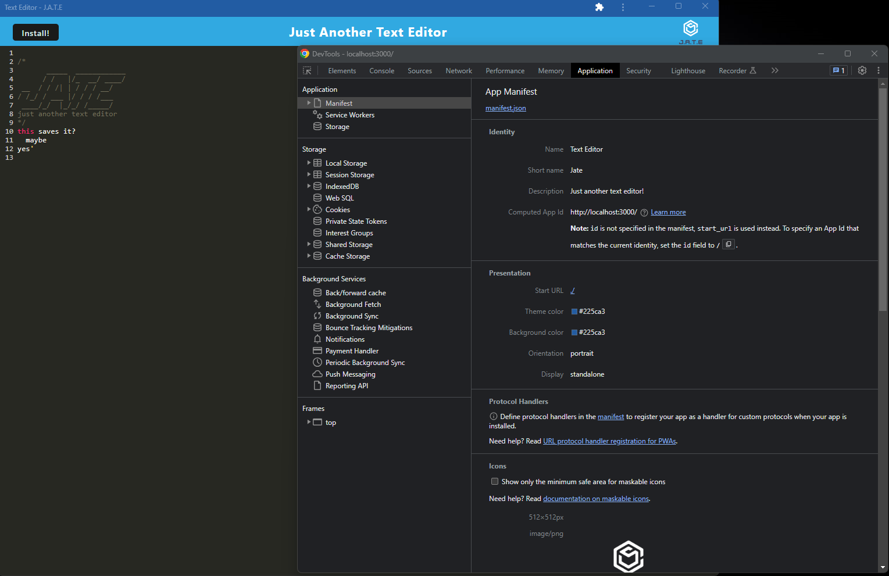
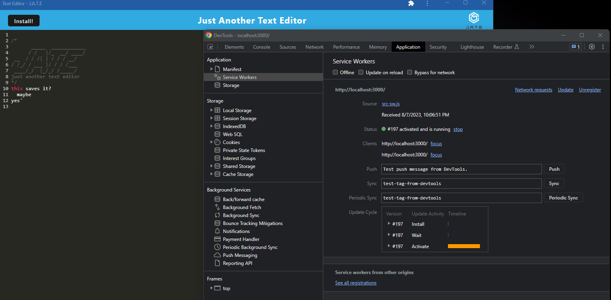
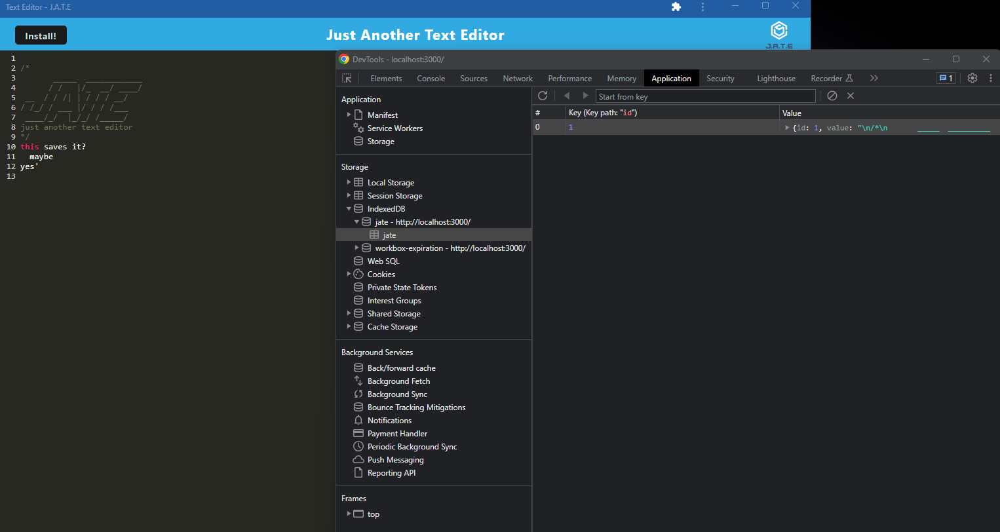

# PWA-Text-Editor

  
  
  ## Table of Contents
  * [Description](#description)
  * [Installations](#installation)
  * [Usage](#usage)
  * [License](#license)
  * [Questions](#questions)

  ## Description
  This application is a text editor that is can be used online and offline.  
  Client can download to the desktop as well.  

  
  
  
  

  ## Installation
  Run `npm i` in the terminal to install the application with necessary packages.

  ## Usage
  Inside the root folder make sure to run `npm run build`.  
  Once the build is over run `npm run start`.

  ## Licenses
    Your application is covered under MIT

  ## Questions
  * Github: https://github.com/jaswindersinghsaini
  
  * heroku: https://pwa-text-editorapp-f44483945246.herokuapp.com/
  
